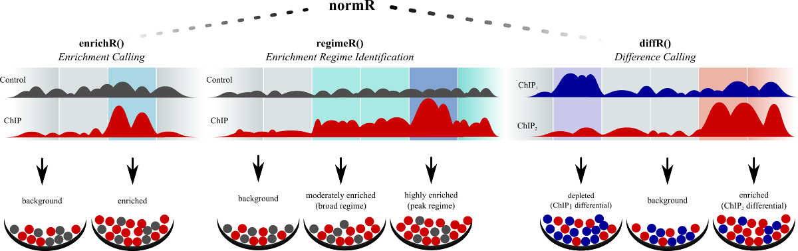
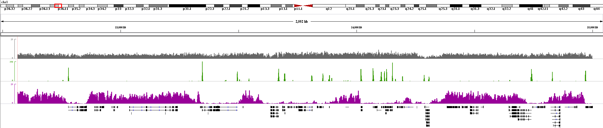
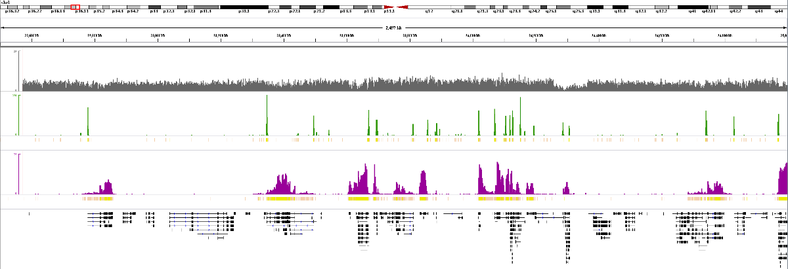

```{r style, echo = FALSE, results = 'asis'}
BiocStyle::markdown()
```



# TL;DR (Too long; didn't read)

* `enrichR()` calls ChIP-seq enrichment over control for coordinate-sorted and
indexed bamfiles
```{r eval=FALSE}
e <- enrichR(treatment = "ChIP.bam",
             control   = "Control.bam",
             genome    = "hg19")
```

* `diffR()` calls differential enrichment between two conditions, *i.e.* two
ChIP-seq tracks
```{r eval=FALSE}
de <- diffR(treatment = "ChIP1.bam",
            control   = "ChIP2.bam",
            genome    = "hg19")
```

* `regimeR()` calls `k` enrichment regimes in a ChIP-seq experiment over
control
```{r eval=FALSE}
re <- regimeR(treatment = "ChIP.bam",
              control   = "Control.bam",
              genome    = "hg19",
              models    = k)
```

* `exportR()` writes above results to bed, bedGraph or bigWig
```{r eval=FALSE}
#export enriched regions with FDR<=10% for downstream analysis
exportR(obj      = e,
        filename = "enriched.bed",
        type     = "bed",
        fdr      = 0.1)
#or
#write normalized differential enrichment to bigWig for genome browser display
exportR(obj      = de,
        filename = "diffEnrichment.bw",
        type     = "bigWig")
```

* give credit if you benefit
```{r}
citation("normr")
```


# Introduction to normR

Chromatin immunoprecipitation followed by sequencing (ChIP-seq) provides
genome-wide localization data for DNA-associated proteins. To infer the
regions bound by such proteins the read densities obtained by such a ChIP-seq
experiment are compared to the corresponding read profile obtained by a
control experiment. A meaningful comparison requires normalization to
mitigate the effects of technical biases, *e.g.* different sequencing depth.
But more importantly the effect of the enrichment of certain regions on the
overall read statistics. Normalization requires knowledge of the regions that
remained unchanged, such that normalization and difference calling are
inseparable.

This package, *normR* (**n**ormR **o**beys **r**egime **m**ixture **R**ules),
follows this logic and performs normalization and difference calling
simultaneously to identify genomic regions enriched by the ChIP-procedure
(`enrichR()`). In addition, normR enables the comparison between ChIP-seq data
obtained from different conditions allowing for unraveling genomic regions that
change their association with the ChIP-target (`diffR()`). Lastly, normR is
capable to differentiate multiple regimes of enrichment, *i.e.* broad domains
and sharp peaks (`regimeR()`). In brief, all these routines encompass three
steps:

1. Count reads in fixed-size windows along the genome;
2. Fit a binomial mixture model by Expectation Maximization;
3. Assign each window a significance based on the fitted background component.

This vignette explains a common workflow of normR analysis on NGS data for
calling enrichment, identification of differential ChIP-seq enrichment and
stratification of enrichment regimes. Herein, we provide examples for the
export of results to common data formats like bigWig and bed. We show how
analysis statistics and diagnostic plots are helpful for studying results. In a
latter section, we cover more advanced topics including the alteration of read
counting strategies, the application of normR on user-defined regions (*e.g.*
promoters) and the integration of Copy Number Variation information in
differential ChIP-seq enrichment calls.


# Toy Examples

## `enrichR()`: Calling Enrichment with an Input Control

In this first section, we would like to call regions significantly enriched for
reads in the ChIP-seq experiment given a Control alignment. Here, we analyze
ChIP-seq data for both H3K4me3 (pointy enrichment) and H3K36me3 (broad
enrichment) given an Input-seq control alignment originating from a human
immortalized myelogenous leukemia line (K562). Using normR, we show that our
representative region on human chromsome 1 (chr1:22500000-25000000) is enriched
for H3K4me3 mostly at promoters and precludes H3K36me3 enrichment which is
  overrepresented in gene bodies.


**IGV browser shot of Input (grey), H3K4me3 (green) and H3K36me3 (purple)
alignment data on chr1 22.5Mb to 25Mb with genes (black) drawn.**

As part of the normR package, we provide 3 alignment files in bam format
(Input, H3K4me3 and H3K36me3 ChIP-seq) containing reads for human chr1 22.5Mb
to 25Mb. Note, bam files used in normR need to be sorted by read coordinates
(`samtools sort x.bam x_sorted`) and indexed (`samtools index x_sorted.bam`).
Our example files already fullfil this criteria.

*Firstly*, we retrieve filepaths for toy data:

```{r message=FALSE}
#Loading required package
library("normr")

inputBamfile <- system.file("extdata", "K562_Input.bam", package="normr")
k4me3Bamfile <- system.file("extdata", "K562_H3K4me3.bam", package="normr")
k36me3Bamfile <- system.file("extdata", "K562_H3K36me3.bam", package="normr")
```

*Secondly and lastly*, we need to specify the genome of the alignment. The
`genome` argument can be a character specifying a UCSC genome identifier,
*e.g.* "hg19", or we can provide a 2-dimensional `data.frame` with columns
seqnames and length. We will follow the later option: You can generate a genome
`data.frame` yourself or can use `GenomeInfoDb` for retrieving the data.frame
from UCSC for given genome identifier:

```{r warning=FALSE}
#Fetch chromosome information
genome <- GenomeInfoDb::fetchExtendedChromInfoFromUCSC("hg19")

#Filter out irregular chromosomes and delete unnecessary columns
idx <- which(!genome$circular & genome$SequenceRole=="assembled-molecule")
genome <- genome[idx,1:2]
genome

#Toy data has only "chr1"
genome <- genome[genome[,1] == "chr1",]
genome
```

*Now*, we are all set to do a enrichment call with default parameters:

```{r warning=FALSE}
#Enrichment Calling for H3K4me3 and H3K36me3
k4me3Fit <- enrichR(treatment = k4me3Bamfile, control = inputBamfile,
                    genome = genome, verbose = FALSE)
k36me3Fit <- enrichR(treatment = k36me3Bamfile, control = inputBamfile,
                     genome = genome, verbose = FALSE)
```

That was easy and fast! You must know that all results are stored as
`NormRFit-class` objects. They provide convenient access to count data and
fitting results. For example, let's have a look at some simple fitting
statistics for H3K4me3:

```{r}
k4me3Fit
```

The "Type" of the `NormRFit` object is defined by the function generating it,
*i.e.* `enrichR()`, `diffR()` or `regimeR()`. The "Number of Regions" is the
number of 250bp bins along the specified genome (default binsize). The "Number
of Components" is 2 (background and enriched) in the case of `enrichR()`. The
parameter  $\theta^*$ ("Theta* (naive bg)") describes a naive background
parametrization if the effect of enrichment is not taken into account. The
actual $\theta_B$ is with ~0.09 much smaller than $\theta^*$ which allows for
more sensitive enrichment calling.  Furthermore, by looking at the "Mixture
Proportions" we find H3K4me3 is enriched in ~5% of the windows. For H3K36me3,
we find ~23% of the regions enriched.

```{r}
k36me3Fit
```

### Analyzing Results

We can use some methods provided by the `NormRFit-class` to get a grasp on the
quality of our normR call, *e.g.* print a more concise summary that gives the
number of significant regions under different False Discovery Rates ($FDR$).

```{r}
summary(k4me3Fit)
```

Note, `summary()` prints an additional section containing information on the
statistical testing. The "T-Filter threshold" filters out regions that are not
considered for multiple testing correction due to low power. The sum of counts
in treatment and control is less than this quantity (Dialsingh *et al.*,
Bioinformatics, 2015, 1–7). The "Number of Regions filtered out" is very large
in our example because the toy alignment files are filtered for reads within
chr1 22.5Mb to 25Mb. However, the specified genome covers `chr1:0-249250621`
which results in alot of zero counts. This does not influence the fit but for
testing the regions are filtered. Based on computed q-vlaues, H3K4me3 shows
587 (24+433+67+63) regions significantly enriched for $FDR \le 0.05$. The
summary for H3K36me3 enrichment calls confirms 2,378 (0+1951+212+215) regions
significantly enriched for $FDR \le 0.05$:

```{r}
summary(k36me3Fit)
```

Based on the fitted background, normR can calculate a standardized, regularized
enrichment for further processing:

```{r}
#background normalized enrichment
k4me3Enr <- getEnrichment(k4me3Fit)

#restrict to regions with non-zero counts
idx <- which(rowSums(do.call(cbind, getCounts(k4me3Fit))) != 0)
summary(k4me3Enr[idx])
```

If we compare H3K4me3 and H3K36me3 enrichment in non-zero regions, we can see
some mutual exclusivity of both marks represented by off-diagonal elements):

```{r fig.width=10, fig.height=10}
x <- k4me3Enr[idx]
y <- getEnrichment(k36me3Fit)[idx]
d.x <- density(x); d.y <- density(y)
limits <- range(x,y)
layout( matrix( c(0,2,2,1,3,3,1,3,3),ncol=3) )
plot(d.x$x, d.x$y, xlim=limits, type='l',
     main="H3K36me3 normalized Enrichment", xlab="", ylab="Density")
abline(v=0, lty=3, lwd=2, col=4)
plot(d.y$y, d.y$x, ylim=limits, xlim=rev(range(d.y$y)), type='l',
     main="H3K4me3 normalized Enrichment", xlab="Density", ylab="")
abline(h=0, lty=3, lwd=2, col=4)
color <- rep("grey10", length(idx))
plot(x, y, xlim=limits, ylim=limits, pch=20, xlab="", ylab="",
     col=adjustcolor(color, alpha.f=.2))
abline(0, 1, lty=2, lwd=3, col=2)
abline(v=0, lty=3, lwd=2, col=4)
abline(h=0, lty=3, lwd=2, col=4)
```

To analyze mutually exclusivity of H3K4me3 and H3K36me3, we would like to
recover the regions signficantly enriched in `k4me3Fit` and `k36me3Fit` and
color these regions in the scatter plot above.

```{r fig.width=10, fig.height=10}
#integer vector with <NA> set to non-significant regions
k4me3Classes <- getClasses(k4me3Fit, fdr = 0.05)
k36me3Classes <- getClasses(k36me3Fit, fdr = 0.05)

#Color scatter plot based on enrichment
color[!is.na(k4me3Classes[idx])] <- "#2C9500"
color[!is.na(k36me3Classes[idx])] <- "#990099"
color[!is.na(k4me3Classes+k36me3Classes)[idx]] <- "#971621"
plot(x, y, xlim=limits, ylim=limits, pch=20,
     col=adjustcolor(color, alpha.f=.5), xlab="H3K4me3 normalized Enrichment",
     ylab="H3K36me3 normalized Enrichment")
legend("topright", pch=20, col=unique(color), cex=.6, bg="white",
  legend=c("Background", "H3K36me3 enriched", "H3K4me3 enriched",
           "H3K4me3/K36me3 enriched")
  )
```

Processing of regions within R can be facilitated by getting significantly
enriched ($FDR \le 0.05%$) regions as a `GRanges` object:

```{r}
k4me3Ranges <- getRanges(k4me3Fit)[!is.na(k4me3Classes)]
#Alternatively you can extract ranges without storing the class vector
k4me3Ranges <- getRanges(k4me3Fit, fdr = 0.05)

#as expected we get 587 regions
length(k4me3Ranges)
```

As a representative analysis, we would like check for overrepresentation of
enriched regions with genes and promoters by using Fisher's exact test. Let's
start with H3K4me3:

```{r warning=FALSE, message=FALSE}
#example gene annotation for representative region (chr1:22500000-25000000)
genes <- read.delim(file = system.file("extdata", "genes.bed",package="normr"),
                    header = FALSE, stringsAsFactors = FALSE)
library("GenomicRanges")
genes <- GRanges(seqnames = genes[, 1],
                 ranges = IRanges(start = genes[, 2], end = genes[, 3]),
                 strand = genes[, 6],
                 ENSTID = genes[, 4])
genes <- unique(genes)

#Fisher-test provides significance of overlap
#(total specifies number of bins in representative region)
overlapOdds <- function(query, subject, total = 10000) {
  subject <- reduce(subject, ignore.strand = TRUE)
  ov1 <- countOverlaps(query, subject)
  m <- matrix(c(sum(ov1 != 0), sum(ov1 == 0),
              ceiling(sum(width(subject))/width(query)[1]-sum(ov1 != 0)), 0),
              ncol = 2)
  m[2,2] <- total - sum(m)
  fisher.test(m, alternative="greater")
}

#Overlap of H3K4me3 with genes
overlapOdds(k4me3Ranges, genes)

#Overlap of H3K4me3 with promoters
promoters <- promoters(genes, upstream = 2000, downstream = 2000)
overlapOdds(k4me3Ranges, promoters)
```

It is known that promoters are marked by H3K4me3 if their gene's expression is
initiated. Our analysis above shows that H3K4me3-enriched regions are indeed
significantly overrepresented within genes (Fisher's signed-exact test;
P-value<0.001; odds ratio = 1.72) and, more pronounced, in promoter regions
(odds ratio = 7.74).

By comparing H3K36me3 and H3K4me3 ranges, we can identify significant overlap
of H3K36me3 and H3K4me3 (odds ratio = 1.53) that is most pronounced in promoter
regions (odds ratio = 9.68) than compared to gene bodies (odds ratio = 2.85).

```{r}
#Overlap of H3K36me3 with H3K4me3
k36me3Ranges <- getRanges(k36me3Fit, fdr = 0.05)
overlapOdds(k36me3Ranges, k4me3Ranges)

#Overlap of H3K36me3 with H3K4me3 at promoter regions
overlapOdds(k36me3Ranges[countOverlaps(k36me3Ranges, promoters) != 0],
            k4me3Ranges[countOverlaps(k4me3Ranges, promoters) != 0])

#Overlap of H3K36me3 with H3K4me3 in genes
overlapOdds(k36me3Ranges[countOverlaps(k36me3Ranges, genes) != 0],
            k4me3Ranges[countOverlaps(k4me3Ranges, genes) != 0])
```

H3K36me3 is associated to transcriptional elongation in the gene body. The
presence of H3K36me3 within the gene body marks transcribed genes.  Indeed,
H3K36me3 enrichment is significantly overrepresented mostly at genes (odds
ratio = 5.52) and, to a lower extend, at promoters (odds ratio = 2.68).

```{r}
#Overlap of H3K36me3 in genes
overlapOdds(k36me3Ranges, genes)

#Overlap of H3K36me3 with promoters
overlapOdds(k36me3Ranges, promoters(genes, 1500, 1500))
```


### Exporting Results

While there exist a plethora of analysis options of normR results within R,
`exportR()` provides functionality to write results to a file. To export
coordinates of enriched regions, the widely used
[BED format](https://genome.ucsc.edu/FAQ/FAQformat.html#format1) is applicable.
It is human-readable and can be imported in common genome browsers, *e.g.*
[UCSC genome browser](https://genome.ucsc.edu/cgi-bin/hgTracks) or
[IGV](http://bioviz.org/). To export the background-normalized enrichment, the
binary [bigWig format](https://genome.ucsc.edu/FAQ/FAQformat.html#format6.1) is
used. Check `?exportR` for more options.

```{r warning=FALSE}
#export coordinates of significantly (FDR <= 0.05) enriched regions
exportR(k4me3Fit, filename = "k4me3Fit.bed", type = "bed", fdr = 0.05)
exportR(k36me3Fit, filename = "k36me3Fit.bed", type = "bed", fdr = 0.05)

#export background-normalized enrichment
exportR(k4me3Fit, filename = "k4me3Fit.bw", type = "bigWig")
exportR(k36me3Fit, filename = "k36me3Fit.bw", type = "bigWig")
```


**IGV browser shot of Input (grey), H3K4me3 (green) and H3K36me3 (purple)
alignment data (bars), normalized enrichment, _i.e._ "bigWig" files, (lines)
and enriched regions, _i.e._ "bed" files (boxes below respective tracks).**

## `diffR()`: Calling Differential Enrichment without a Control Experiment

Normalization and difference calling are inseparable in calling ChIP-seq
enrichment. Following this notion, a direct comparison of two ChIP-seq tracks
can be performed with `diffR()`. In many studies, researchers are interested in
conditional changes in ChIP-seq enrichment. Below, we exemplify this analysis
by joint analysis of H3K4me3 and H3K36me3 ChIP-seq data. Because we already
counted `k4me3Bamfile` and `k36me3Bamfile` already in `k4me3Fit` and
`k36me3Fit`, respectively, we can use these counts directly. Note that, in this
case, the `genome` has be set to a `GenomicRanges` object specifying the
genomic regions.  We can extract this from either one of the `NormRFit`
objects.

```{r warning=FALSE}
#We could use read counts from above NormRFit objects
k4k36Dif <- diffR(treatment = getCounts(k4me3Fit)$treatment,
                  control   = getCounts(k36me3Fit)$treatment,
                  genome    = getRanges(k4me3Fit),
                  verbose   = FALSE)
#<or> (unnecessarily) count again
#k4k36Dif <- diffR(treatment = k4me3Bamfile, control = k36me3Bamfile,
#                  genome = genome, verbose = FALSE)

#summary statistics
summary(k4k36Dif)
```

The "Type" of the object has changed to 'diffR' because it was generated by
this function. The "Number of Regions" did not change because we use the same
binning strategy. However, the "Number of Components" is now 3 representing (i)
H3K36me3 enrichment without H3K4me3-enrichment, (ii) H3K36me3 and H3K4me3
(non)-enriched and (iii) H3K4me3 enrichment without H3K36me3-enrichment. The
"Backgroundcomponent B" is 2 in this case: `diffR()` identifies significant
enrichment and depletion by a two-sided test on the background. Looking at the
"Mixture Proportions", regions are classified to (i) in ~49.8%, (ii) in
~29.5% and (iii) in ~20.7% of the regions. 2,629 regions are significantly
different from background with $FDR \le 0.05$. These regions are either
H3K4me3-positive or H3K36me3 positive. We can export these regions and the
normalized enrichment with `exportR`:

```{r warning=FALSE}
exportR(k4k36Dif, filename = "k4k36Dif.bed", type = "bed", fdr = 0.05)
exportR(k4k36Dif, filename = "k4k36Dif.bw", type = "bigWig")
```


**IGV browser shot of Input (grey), H3K4me3 (green) and H3K36me3 (purple)
alignment data. Background normalized difference is plotted as a heatmap,
_i.e._ "bigWig" file, and differential regions are plotted as boxes, _i.e._
"bed" file (blue: treatment (H3K4me3) enriched, red: control (H3K36me3)
enriched).**

## `regimeR()`: Identify Enrichment Regimes in ChIP-seq Experiments

The two sections above aimed at discerning enrichment from background. The
extendable normR approach also allows for identification of different
enrichment regimes with `regimeR()` by increasing the number of model
components.

Let's start with 3 components (Background + 2 Enrichment Regimes) for H3K4me3.
By using two enrichment regimes, we may uncover effects of sample heterogeneity
affecting transcriptional initiation of certian genes.

```{r warning=FALSE}
k4me3Regimes <- regimeR(treatment = getCounts(k4me3Fit)$treatment,
                         control   = getCounts(k4me3Fit)$control,
                         genome    = getRanges(k4me3Fit),
                         models    = 3,
                         verbose   = FALSE)
summary(k4me3Regimes)
```

~10.5% of the regions show enrichment which gets segmented into ~7.7% low
and ~2.8% high enrichment. 692 regions are significant ($FDR \le 0.05$).

Now, we would like to use two enrichment regimes for H3K36me3. In this way, we
might be able to classify genes of low and high transcriptional rates:

```{r warning=FALSE}
k36me3Regimes <- regimeR(treatment = getCounts(k36me3Fit)$treatment,
                         control   = getCounts(k36me3Fit)$control,
                         genome    = getRanges(k36me3Fit),
                         models    = 3,
                         verbose   = FALSE)
summary(k36me3Regimes)
```

We can now export the called regimes as bed files for browser display. Each
track has two enrichment regimes which are shaded for their degree of
significance. The export is done analogously to the cases described above:

```{r warning=FALSE}
exportR(k4me3Regimes, filename = "k4me3Regimes.bed", type = "bed", fdr=0.05)
exportR(k36me3Regimes, filename = "k36me3Regimes.bed", type = "bed", fdr=0.05)
```


**IGV browser shot of Input (grey), H3K4me3 (green) and H3K36me3 (purple)
alignment data. Regime calls are plotted as boxes below respective tracks
(Yellow = low enrichment, Pink = high enrichment)**

# Advanced Topics

In addition to the information covered above, it is recommend to have a look at
help pages (`?`) of normR functions. Here, we would like to discuss three
important points:

## Change Read Counting Strategy with `NormRCountConfig-class`

It is very important how we count reads contained in the bamfile. The
`NormRCountConfig-class` provides methods to define the counting strategy on
single-end and paired-end alignment data:

```{r eval=FALSE}
#Single End:
# Count in 500bp bins.
# Consider only reads with Mapping Quality >= 20.
# Filter reads for marked duplicates (e.g. with picard mark-duplicates)
# Shift the counting position for a read 100 bp downstream.
countConfigSE <- countConfigSingleEnd(binsize = 500, mapq = 20,
                                      filteredFlag = 1024, shift = 100)

#Paired End:
# Count in 500bp bins.
# Consider only reads with Mapping Quality >= 30.
# Count the midpoint of the aligned fragment instead of 5' ends.
# Consider only reads corresponding to fragments with size from 100 to 300bp
countConfigPE <- countConfigPairedEnd(binsize = 500, mapq = 30, midpoint=TRUE,
                                      tlenFilter = c(100, 300))

#Plug in the counting configuration into normR, e.g. in enrichR()
fit <- enrichR(treatment   = k4me3Bamfile,
               control     = inputBamfile,
               genome      = genome,
               countConfig = countConfigPE)
```

## Analyzing Predefined Regions

You could do a fit on a set of pre-defined regions like promoters or known
transcription factor binding sites. You need to count beforehand with
`bamsignals`. Note, for the fit to work correctly these regions should be of
same size.

```{r warning=FALSE}
promoters <- promoters(genes, 1500, 1500)
#regions have identical size?
all(width(promoters) == 3000)
```

```{r}
#Fit only on promoters
promotersFit <- enrichR(treatment = k4me3Bamfile, control = inputBamfile,
                        genome = promoters, verbose = FALSE)
summary(promotersFit)
```

## Post-processing of Difference Calls with CNV information

Copy Number Variations (CNVs) are an important feature of cancerous cells like
tumour samples. The difference calling on two ChIP-seq experiments with
`diffR()` is sensitive to CNVs if the underlying sequence is amplified in the
genome. However, you can harness `diffR()`'s functionality to call differences
in two Input tracks to detect CNVs in a treatment respective to a control. To
allow for coarse-grained detection of difference in Input, a sufficiently large
binsize has to be used, _e.g._ 22kb.

```{r eval=FALSE}
cnvs <- diffR(treatment   = treatmentInputBamfile,
              control     = controlInputBamfile,
              genome      = genome,
              countConfig = countConfigSingleEnd(binsize = 2.5e4))

#export the CNV calls
exportR(cnvs, "CNVs.bed")

#Filter previous ChIP-seq difference calls for CNVs
ov <- countOverlaps(getRanges(diffFit, fdr = .05), getRanges(cnvs, fdr = .05))
idx <- which(ov == 0)
cnvCleanedGR <- getRanges(diffFit, fdr = .05)[idx]
```
